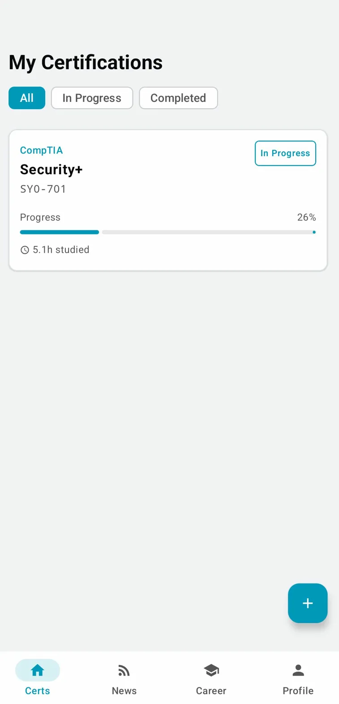
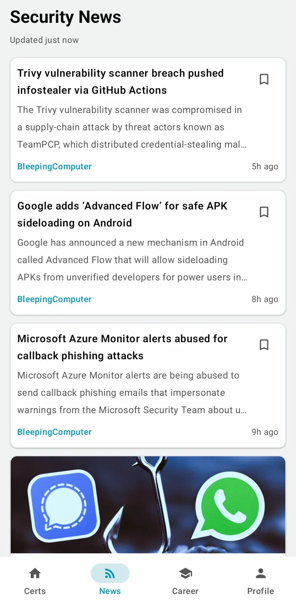
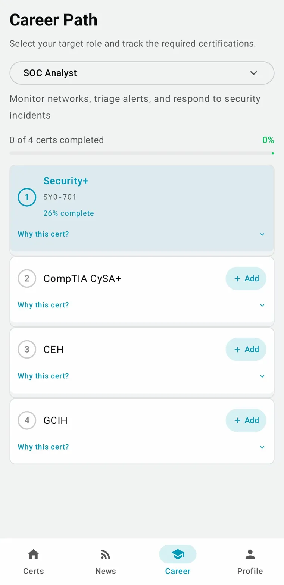
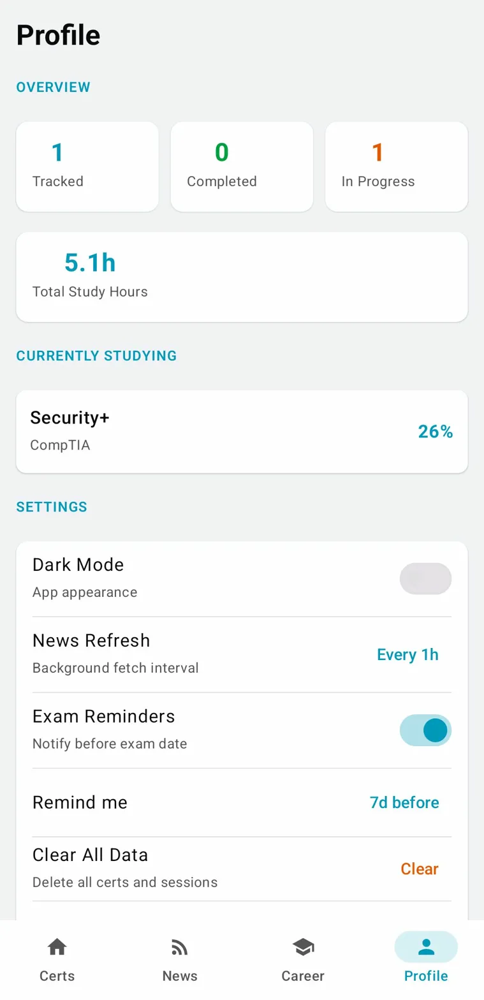

<div align="center">
  <h1>CyberCert</h1>
  <p>Android app for tracking cybersecurity certifications and staying up to date with infosec news.</p>

  
  
  
  
</div>

---

## Screenshots

<div align="center">
  
  
  
  
</div>

---

## Features

### Certification Tracker
- Track progress across 42+ certifications from 12 providers
- Log study sessions and accumulate hours per certification
- Set exam dates with countdown timers
- Filter by status: All, In Progress, Completed
- Add certs from a built-in catalog — no manual entry needed

### Security News Feed
- Live feed from 6 curated sources: The Hacker News, Krebs on Security, CISA, NCSC UK, BleepingComputer, SecurityWeek
- Locale-aware: CCN-CERT (Spain) added automatically for Spanish users
- Cached for instant load — news available offline after first fetch
- Pull to refresh, bookmark articles, open in browser
- Double-tap News tab to force refresh

### Career Path Roadmap
- 8 predefined career paths: SOC Analyst, Pentester, Cloud Security Engineer, Incident Responder, Malware Analyst, Security Engineer, DevSecOps, Forensics Analyst
- Shows required certs in order with your current progress overlaid
- "Why this cert?" expandable explanations for each step
- Add missing certs directly from the roadmap
- Path progress bar showing completion percentage

### Profile & Settings
- Overview stats: tracked, completed, in progress, total study hours
- Dark / Light theme toggle (persisted)
- News refresh interval: manual, 1h, 6h, 24h
- Exam date reminders with configurable lead time
- Clear all data option

---

## Supported Certification Providers

CompTIA · EC-Council · Offensive Security · eLearnSecurity · ISACA · ISC2 · GIAC · Mile2 · TCM Security · Cisco · Google · Microsoft

---

## Tech Stack

| Layer | Tech |
|---|---|
| Language | Kotlin 2.1.0 |
| UI | Jetpack Compose + Material3 |
| Database | Room 2.7.0 |
| Background | WorkManager 2.10.0 |
| Networking | OkHttp 4.12.0 |
| Image loading | Coil 2.7.0 |
| Preferences | DataStore |
| Architecture | MVVM, single Activity |
| Min SDK | 26 (Android 8.0) |

---

## Build

```bash
git clone https://github.com/blank-0x/cybercert.git
cd cybercert
./gradlew assembleDebug
```

Requires Android Studio Hedgehog or later.

---

## Roadmap

- [ ] Exam countdown home screen widget
- [ ] Study streak tracking
- [ ] Full cert detail page with resources and prerequisites
- [ ] News filtering by category
- [ ] Bookmarked news tab

---

## License

MIT © blank-0x
